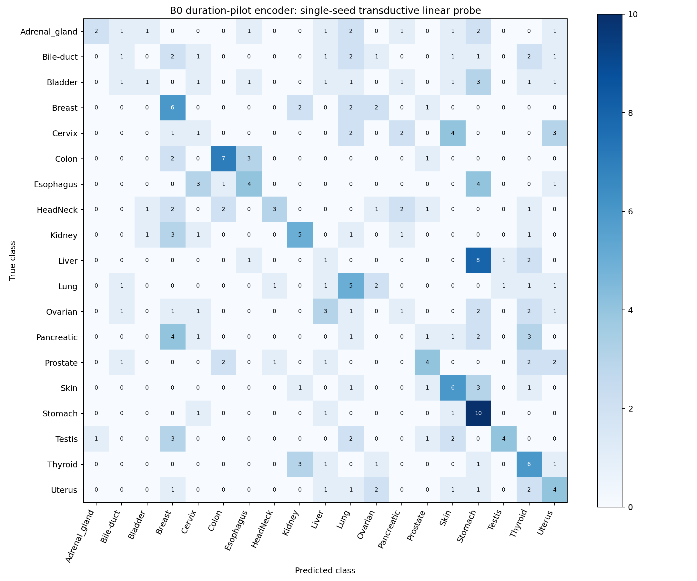

# B0 duration-pilot final linear probe

The selected encoder achieved **28.34% test accuracy** and **26.65% test macro-F1** (70/247 correct). This is a **single-seed, transductive B0 linear-probe result** using **epoch 10 of the 300-epoch schedule with 30-epoch warmup**.

| Test metric | Result |
|---|---:|
| Accuracy | 28.34% |
| Balanced accuracy | 28.34% |
| Macro-F1 | 26.65% |
| Weighted-F1 | 26.65% |

The winning probe used AdamW, LR **0.001**, weight decay **0**, and probe epoch **17**. Its validation macro-F1 was **34.66%**. The test set has 13 samples in every class; therefore balanced accuracy equals accuracy and weighted-F1 equals macro-F1.

## Protocol and verification

The sole encoder input was `/raid1/xwan0900/SSL_proj/outputs/b0_duration_pilot/checkpoints/best.pt`. Checkpoint metadata confirmed a student-only epoch-10 encoder, the 300-epoch schedule, and warmup fraction 0.1. Its SHA256 before and after the workflow was `0ca82b2a513e739d73c586684b7c1aeb5b52dd4ab9b2f40e3ca8874b7b0be64d`. Encoder tensor hashes also matched before and after extraction. All encoder parameters were frozen, with no gradients.

Clean 256×256 images used the existing CLIP normalization. Encoder inference used BF16 autocast and deterministic algorithms; the 64 patch tokens were converted to FP32 and mean-pooled to 768 dimensions. A repeated 256-image training batch produced bitwise identical features. Training and validation features were extracted once into their own cache; test features were extracted once after selection was locked. No duplicated images were written to disk.

Metadata checks verified 2,052 training, 247 validation, and 247 test images, with 108/13/13 samples per class. Only metadata for test was checked before selection; test images were not decoded or evaluated. The extraction loader specifically restricted image decoding to train and validation until the final stage.

A two-epoch smoke trial exercised the actual probe training loop before the real grid. Training-feature mean and sample standard deviation (floor 1e-6) were used to standardize every split. Each actual trial trained a `Linear(768, 19)` head, batch size 256, at most 50 epochs, patience 8, and constant LR. The existing seed 20260903 was reset identically for each trial, so initialization and shuffling were controlled. All six trials received the identical cached features and standardized tensor hashes. The train/validation cache SHA256 was `c82f70625d5e8eaa4492962cd0a20fafc53b466955aa782974182a0f879c44eb`.

Only the winning probe checkpoint was saved. The hyperparameters, selected epoch, and probe checkpoint hash were saved before test access. An exclusive test-start marker prevents accidental re-evaluation. The held-out test classifier was evaluated once, and the resulting predictions were saved for reporting. Final read-only checks confirmed the frozen selection hash, probe hash, encoder hash, six matching cache hashes, one saved probe checkpoint, and unchanged old `b0_final` file-size/mtime manifest.

## Validation selection

| LR | Weight decay | Best probe epoch | Epochs executed | Validation macro-F1 |
|---:|---:|---:|---:|---:|
| 0.001 | 0 | 17 | 25 | 34.6569% |
| 0.001 | 0.0001 | 17 | 25 | 34.6569% |
| 0.003 | 0 | 5 | 13 | 32.0831% |
| 0.003 | 0.0001 | 5 | 13 | 32.0831% |
| 0.01 | 0 | 5 | 13 | 29.2727% |
| 0.01 | 0.0001 | 5 | 13 | 29.2727% |

Ties retain the earliest epoch within each trial and the first candidate in the configured grid across trials. Thus weight decay 0 was selected from the tied LR-0.001 trials. The two-epoch smoke trial was excluded from selection.

## Per-class test metrics

All metrics below are percentages; every class has 13 test samples.

| Class | Precision | Recall | F1 |
|---|---:|---:|---:|
| Adrenal gland | 66.67 | 15.38 | 25.00 |
| Bile duct | 16.67 | 7.69 | 10.53 |
| Bladder | 25.00 | 7.69 | 11.76 |
| Breast | 24.00 | 46.15 | 31.58 |
| Cervix | 10.00 | 7.69 | 8.70 |
| Colon | 58.33 | 53.85 | 56.00 |
| Esophagus | 40.00 | 30.77 | 34.78 |
| HeadNeck | 60.00 | 23.08 | 33.33 |
| Kidney | 45.45 | 38.46 | 41.67 |
| Liver | 8.33 | 7.69 | 8.00 |
| Lung | 23.81 | 38.46 | 29.41 |
| Ovarian | 0.00 | 0.00 | 0.00 |
| Pancreatic | 0.00 | 0.00 | 0.00 |
| Prostate | 40.00 | 30.77 | 34.78 |
| Skin | 33.33 | 46.15 | 38.71 |
| Stomach | 27.03 | 76.92 | 40.00 |
| Testis | 66.67 | 30.77 | 42.11 |
| Thyroid | 25.00 | 46.15 | 32.43 |
| Uterus | 25.00 | 30.77 | 27.59 |

The CSV confusion matrix uses class IDs 0–18 in the order shown in `test_per_class_metrics.csv`; rows are true classes and columns are predicted classes. Full precision metrics are preserved in the CSV and JSON artifacts.

## Interpretation and reproducibility

SSL pretraining used all **7,901 images unlabeled**, including downstream validation and test images. This is transductive evaluation. The duration pilot selected the best checkpoint under its particular schedule and validation rule; this result does not establish a universally optimal SSL epoch count. A later reproducibility study should use fixed warmup steps and multiple SSL seeds. No SSL training was rerun here. No fine-tuning, retrieval, or zero-shot evaluation was part of this authorized linear-probe protocol.

Remote output directory: `/raid1/xwan0900/SSL_proj/outputs/b0_duration_pilot_final_probe`

Separate config: `/raid1/xwan0900/SSL_proj/configs/b0_duration_final_probe.yaml`

The four completed entrypoints, executed in order from `/raid1/xwan0900/SSL_proj` with `/raid1/xwan0900/venvs/ftkp_cu128/bin/python`, were:

1. `scripts/extract_b0_duration_probe_features.py`
2. `scripts/smoke_b0_duration_final_probe.py`
3. `scripts/tune_b0_duration_final_probe.py`
4. `scripts/test_b0_duration_final_probe_once.py`

Shared implementation: `scripts/b0_duration_final_probe.py`. The implementation reuses the existing probe fit loop but isolates feature extraction, smoke testing, validation selection, and final evaluation. The final test entrypoint must not be rerun; reports can use the saved `test_predictions.npz`.
