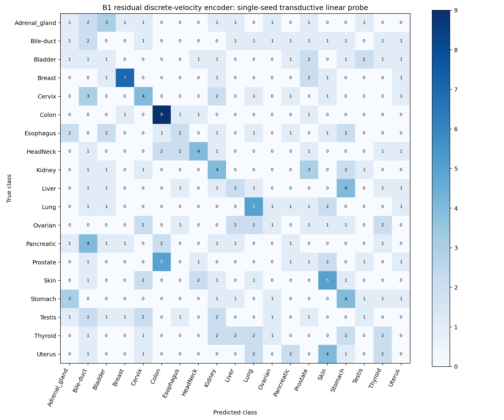

# B1 duration-pilot final linear probe

The selected B1 encoder achieved **22.6721% test accuracy** and **21.7398% test macro-F1** (**56/247 correct**). This is a **single-seed, transductive B1 residual discrete-velocity linear-probe result** using **epoch 30 of the 300-epoch schedule with 30-epoch warmup**.

| Test metric | Result |
|---|---:|
| Accuracy | 22.6721% |
| Balanced accuracy | 22.6721% |
| Macro-F1 | 21.7398% |
| Weighted-F1 | 21.7398% |

The winning frozen probe used AdamW, LR **0.01**, weight decay **0**, and probe epoch **19**. Its validation macro-F1 was **26.8504%**. The test set has 13 samples in every class, so balanced accuracy equals accuracy and weighted-F1 equals macro-F1.

## B1 duration and objective

B1 retains the B0-matched predictor capacity and conditions on severity, action, and the fixed adjacent transition. Its residual endpoint is expressed as: predicted_target = student_tokens + (target_severity - source_severity) × velocity. For all four transitions, target_severity - source_severity = -0.25. The saved smoke artifact confirms 1.00→0.75, 0.75→0.50, 0.50→0.25, and 0.25→0.00 for both defocus and resolution, with student/velocity shape [B, 64, 768].

Duration selection used only validation macro-F1. The selected checkpoint is epoch 30 with validation score **0.3481603188**. The 300-epoch endpoint scored **0.2885571558**, so the saved extension audit recorded requires_extension=false and allowed the final probe to proceed. The selected checkpoint SHA256 is ab527478c4134f972a1d47ea0532f975eb396f5f4cda4c267ea544c05eccfb1d.

## Protocol and verification

The resolved B1 configuration records a fresh PLIP ViT-B/32 encoder with 256×256 inputs, 64 patch tokens of width 768, batch size 128, BF16, AdamW, LR 1e-4→1e-6, weight decay 0.04→0.40, EMA 0.996→1.0, gradient clipping at 5, and 300 epochs with 30 warmup epochs. SSL used all **7,901 images unlabeled**, including downstream validation and test images. This is transductive evaluation; downstream labels were not used in the SSL objective or duration selection.

The required GPU smoke test passed: three BF16 optimization steps, both actions, all four adjacent transitions, finite losses, nonzero severity/action/delta conditioner gradients, maximum constructed-endpoint error 2.38e-7, teacher stop-gradient/EMA isolation, and no validation or test image decode. It recorded images_persisted=false, peak GPU memory 1.91 GiB, and protected_b0_ijepa_unchanged=true.

Final-probe extraction decoded only train and validation, froze every encoder parameter, used BF16 autocast followed by FP32 token mean pooling, and produced deterministic repeated features with token shape [64, 768]. The feature cache SHA256 is 52b9b2c329cca4edc746556d1a7812b7c886dcf528c35831cbf0bcd971759dbe; metadata counts are train 2,052, validation 247, and test 247, with 108/13/13 per class. Standardization used training features only, sample standard deviation, and a 1e-6 floor. The six probe trials reused the identical cached features and standardized tensor.

The final probe grid was LR {0.001, 0.003, 0.01} × weight decay {0, 0.0001}, with AdamW, batch size 256, constant LR, maximum 50 epochs, patience 8, and seed 20260903. Selection used validation macro-F1, with earliest epoch within a trial and first configured grid candidate for exact ties.

The test entrypoint created its exclusive start marker before test loading. Test extraction decoded only the test split once; the saved summary records test_evaluations=1 and 247 test samples. The saved prediction SHA256 is 7e76156f411a6772923128ab99ef5e0d3cbc968b2fbb0f1fe5dbe3ae6b0e1744. Reporting after that point uses the saved predictions and metrics only; the guarded test entrypoint must not be rerun.

The B1 protected manifest contains 129 entries. Its post-run status recorded B0/I-JEPA unchanged.

## Validation probe grid

| LR | Weight decay | Best probe epoch | Epochs executed | Validation macro-F1 |
|---:|---:|---:|---:|---:|
| 0.001 | 0 | 13 | 21 | 23.8095% |
| 0.001 | 0.0001 | 13 | 21 | 23.8095% |
| 0.003 | 0 | 12 | 20 | 23.6032% |
| 0.003 | 0.0001 | 12 | 20 | 23.6032% |
| 0.01 | 0 | 19 | 27 | 26.8504% |
| 0.01 | 0.0001 | 19 | 27 | 26.8504% |

The two tied LR-0.01 rows share the same validation result; weight decay 0 was selected by the configured first-candidate tie rule. The smoke trial was excluded from selection.

## Per-class test metrics

All entries are percentages; every class has 13 test samples.

| Class | Precision | Recall | F1 |
|---|---:|---:|---:|
| Adrenal_gland | 10.00 | 7.69 | 8.70 |
| Bile-duct | 9.09 | 15.38 | 11.43 |
| Bladder | 8.33 | 7.69 | 8.00 |
| Breast | 63.64 | 53.85 | 58.33 |
| Cervix | 26.67 | 30.77 | 28.57 |
| Colon | 47.37 | 69.23 | 56.25 |
| Esophagus | 25.00 | 15.38 | 19.05 |
| HeadNeck | 44.44 | 30.77 | 36.36 |
| Kidney | 21.05 | 30.77 | 25.00 |
| Liver | 20.00 | 15.38 | 17.39 |
| Lung | 31.25 | 38.46 | 34.48 |
| Ovarian | 14.29 | 7.69 | 10.00 |
| Pancreatic | 11.11 | 7.69 | 9.09 |
| Prostate | 6.67 | 7.69 | 7.14 |
| Skin | 27.78 | 38.46 | 32.26 |
| Stomach | 21.05 | 30.77 | 25.00 |
| Testis | 14.29 | 7.69 | 10.00 |
| Thyroid | 16.67 | 15.38 | 16.00 |
| Uterus | 0.00 | 0.00 | 0.00 |

The CSV confusion matrix uses class IDs 0–18 in the order shown above; rows are true classes and columns are predicted classes. Full precision values remain in test_per_class_metrics.csv, and the saved prediction arrays remain in test_predictions.npz.

## Interpretation limits

This is one SSL seed and one held-out linear-probe evaluation in a transductive PanNuke setting. It does not establish statistical significance, a universal optimal SSL duration, or inductive generalization. The selected epoch is a result of this particular 300-epoch schedule, 30-epoch warmup, validation monitor, and strict selection rule; it should not be interpreted as a generally optimal epoch. SSL included downstream validation and test images without labels, so this result should not be described as an inductive benchmark. It also does not establish that all degradation-dynamics SSL formulations fail: B1 differs from B0 in residual velocity parameterization and from I-JEPA in objective, masking, and predictor design.

Remote output directory: /raid1/xwan0900/SSL_proj/outputs/b1_duration_pilot_final_probe

Primary saved artifacts used for this report are linear_probe_summary.json, selection.json, probe_leaderboard.csv, test_per_class_metrics.csv, test_confusion_matrix.csv, duration_selection.json, duration_extension_audit.json, pretrain_summary.json, resolved_config.json, and the smoke/extraction audit JSON files. No encoder, image loader, probe, training, or guarded test entrypoint was run to create this report.
