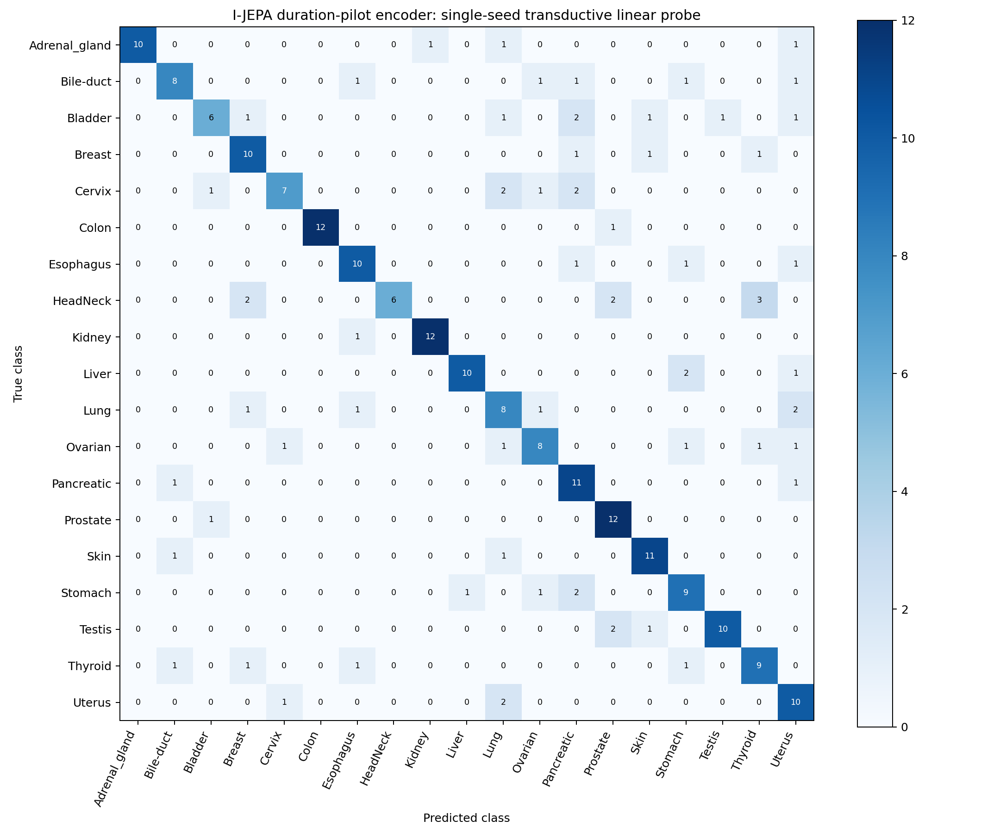

# I-JEPA versus B0: matched downstream comparison

Both rows are single-seed, transductive linear-probe results. SSL used all 7,901 PanNuke images unlabeled, including downstream validation/test images.

| Test metric | B0 | I-JEPA | I-JEPA − B0 (pp) |
|---|---:|---:|---:|
| Accuracy | 28.34% | 72.47% | +44.13 |
| Balanced accuracy | 28.34% | 72.47% | +44.13 |
| Macro-F1 | 26.65% | 72.57% | +45.92 |
| Weighted-F1 | 26.65% | 72.57% | +45.92 |

B0: 70/247 correct; I-JEPA: 179/247 correct. Each class has 13 test images, so accuracy equals balanced accuracy and weighted-F1 equals macro-F1.

| Selection | B0 | I-JEPA |
|---|---:|---:|
| Selected SSL epoch | 10 | 210 |
| Duration-monitor validation macro-F1 | 33.0250% | 81.8801% |
| Probe LR | 0.001 | 0.01 |
| Probe weight decay | 0 | 0.0 |
| Selected probe epoch | 17 | 6 |
| Final-probe validation macro-F1 | 34.6569% | 81.5902% |

B0 uses **epoch 10 of the 300-epoch schedule with 30-epoch warmup**. I-JEPA uses **epoch 210 of the 300-epoch schedule with 30-epoch warmup**. Each encoder was independently selected using validation macro-F1; the six-trial final probe was then selected separately.

## Matched protocol and implementation

Both use fresh random ViT-B/32 encoders from the local architecture configuration, seed 20260903, clean native 256×256 images, 64 patch tokens of width 768, batch size 128, AdamW, BF16, 300 epochs and 30 warmup epochs, LR 1e-4→1e-6, weight decay 0.04→0.40, EMA 0.996→1.0, and gradient clipping at norm 5. B0 is the retained completed run; it was never retrained or retested.

I-JEPA predicts LayerNorm-normalized, stop-gradient teacher patch targets from a masked student context using Smooth-L1. Patches are removed before encoder attention. The predictor uses width 384, two Transformer blocks, six heads, MLP ratio four, and fixed two-dimensional sine/cosine positions with learned target mask queries. B0 degradation conditioning and variance/covariance regularization are absent.

This is the requested matched-objective adaptation, not an official-scale I-JEPA reproduction. Its 8×8 mask sampler draws target scales 0.15–0.20, context scales 0.85–1.0, and target aspect ratios 0.75–1.5 before integer rectangle rounding. Rounding realizes 8, 9, or 12 tokens per target. Four targets are mutually disjoint and removed from the context; at least 10 context tokens remain. Contexts are randomly trimmed to the batch-minimum length. Native CLIP CLS is retained alongside visible context tokens; target pixels cannot enter its attention. The official implementation permits target-target overlap; the stricter disjointness here follows the approved comparison plan.

Duration monitoring uses the same weighted 20-NN and deterministic LBFGS probe math as B0 at epoch 0 and every 10 epochs. A new strict loader decodes only train/validation for monitoring. The selection threshold is ≥0.005 macro-F1 improvement, retaining earlier ties. SSL itself decodes all 7,901 images without using downstream labels. The only saved SSL checkpoint is the selected student.

Final probing freezes the encoder and mean-pools FP32-converted patch tokens to 768 features after BF16 inference. The 2,052/247 train/validation feature arrays are cached once. Sample mean/std are fitted on training only, with std floor 1e-6. Each Linear(768,19) uses AdamW, batch size 256, constant LR, seed 20260903, at most 50 epochs, patience eight. LR {0.001,0.003,0.01} × weight decay {0,0.0001} are selected by validation macro-F1, with earliest-epoch/first-grid-candidate ties. The 247-image test set is decoded and evaluated once only after selection is frozen.

## Verification

The GPU smoke checked 1,600 mask examples, three real-image optimization steps, finite loss/gradients, frozen teacher and EMA, predictor block ordering, 64×768 shape, and exact invariance of student context outputs to changes in held-out target pixels. Pretrained weight-loading calls were forbidden. Metadata retained 2,052/247/247 totals and 108/13/13 per-class counts. No original image copies were saved.

Final-probe smoke checked frozen encoder tensor hashes before/after extraction, exact repeated-batch determinism, train-only standardization, a two-epoch trial, and cache/tensor identity across all six real trials. Selected checkpoint, feature cache, probe, selection, saved prediction and exclusive test marker hashes are audited. A guarded second entrypoint invocation correctly raised FileExistsError before image extraction (which was explicitly mocked to fail if reached); the classifier was evaluated only once. Full SHA256/size/mtime manifests confirm B0 outputs, original metadata, and pre-existing source/config/script files remain unchanged.

I-JEPA encoder SHA256: `6f1a9fdac128b09f601fbb9af63d29f428ae7d06f77031979726d51b416bf76f`. B0 encoder SHA256: `0ca82b2a513e739d73c586684b7c1aeb5b52dd4ab9b2f40e3ca8874b7b0be64d`.

## I-JEPA validation grid

| LR | Weight decay | Best epoch | Epochs run | Validation macro-F1 |
|---:|---:|---:|---:|---:|
| 0.001 | 0.0 | 18 | 26 | 77.4527% |
| 0.001 | 0.0001 | 18 | 26 | 77.4527% |
| 0.003 | 0.0 | 9 | 17 | 79.7296% |
| 0.003 | 0.0001 | 9 | 17 | 79.7296% |
| 0.01 | 0.0 | 6 | 14 | 81.5902% |
| 0.01 | 0.0001 | 6 | 14 | 81.5902% |

## Per-class held-out metrics

All precision/recall/F1 entries are percentages; each class has 13 test examples.

| Class | B0 P | B0 R | B0 F1 | I-JEPA P | I-JEPA R | I-JEPA F1 | ΔF1 pp |
|---|---:|---:|---:|---:|---:|---:|---:|
| Adrenal_gland | 66.67 | 15.38 | 25.00 | 100.00 | 76.92 | 86.96 | +61.96 |
| Bile-duct | 16.67 | 7.69 | 10.53 | 72.73 | 61.54 | 66.67 | +56.14 |
| Bladder | 25.00 | 7.69 | 11.76 | 75.00 | 46.15 | 57.14 | +45.38 |
| Breast | 24.00 | 46.15 | 31.58 | 66.67 | 76.92 | 71.43 | +39.85 |
| Cervix | 10.00 | 7.69 | 8.70 | 77.78 | 53.85 | 63.64 | +54.94 |
| Colon | 58.33 | 53.85 | 56.00 | 100.00 | 92.31 | 96.00 | +40.00 |
| Esophagus | 40.00 | 30.77 | 34.78 | 71.43 | 76.92 | 74.07 | +39.29 |
| HeadNeck | 60.00 | 23.08 | 33.33 | 100.00 | 46.15 | 63.16 | +29.82 |
| Kidney | 45.45 | 38.46 | 41.67 | 92.31 | 92.31 | 92.31 | +50.64 |
| Liver | 8.33 | 7.69 | 8.00 | 90.91 | 76.92 | 83.33 | +75.33 |
| Lung | 23.81 | 38.46 | 29.41 | 50.00 | 61.54 | 55.17 | +25.76 |
| Ovarian | 0.00 | 0.00 | 0.00 | 66.67 | 61.54 | 64.00 | +64.00 |
| Pancreatic | 0.00 | 0.00 | 0.00 | 55.00 | 84.62 | 66.67 | +66.67 |
| Prostate | 40.00 | 30.77 | 34.78 | 70.59 | 92.31 | 80.00 | +45.22 |
| Skin | 33.33 | 46.15 | 38.71 | 78.57 | 84.62 | 81.48 | +42.77 |
| Stomach | 27.03 | 76.92 | 40.00 | 60.00 | 69.23 | 64.29 | +24.29 |
| Testis | 66.67 | 30.77 | 42.11 | 90.91 | 76.92 | 83.33 | +41.23 |
| Thyroid | 25.00 | 46.15 | 32.43 | 64.29 | 69.23 | 66.67 | +34.23 |
| Uterus | 25.00 | 30.77 | 27.59 | 52.63 | 76.92 | 62.50 | +34.91 |

Rows are true classes; columns are predicted classes. Class order is the per-class table above. Numeric matrices and saved test predictions accompany this report.

## Interpretation limits

These are descriptive results from one SSL seed per method, not evidence of statistical significance or a universal optimal SSL duration. Each checkpoint belongs to its full 300-epoch schedule with 30-epoch warmup. A subsequent reproducibility study should fix warmup steps and use multiple SSL seeds. The comparison is specific to this small transductive PanNuke setting, this coarse 8×8 mask adaptation, and the matched lightweight predictor; it does not establish the performance of published full-scale I-JEPA. Fine-tuning, zero-shot and retrieval metrics were not evaluated in this linear-probe workflow.

References: [I-JEPA paper](https://openaccess.thecvf.com/content/CVPR2023/html/Assran_Self-Supervised_Learning_From_Images_With_a_Joint-Embedding_Predictive_Architecture_CVPR_2023_paper.html); [official configuration](https://github.com/facebookresearch/ijepa/blob/main/configs/in1k_vith16-448_ep300.yaml); [official masking implementation](https://github.com/facebookresearch/ijepa/blob/main/src/masks/multiblock.py).
